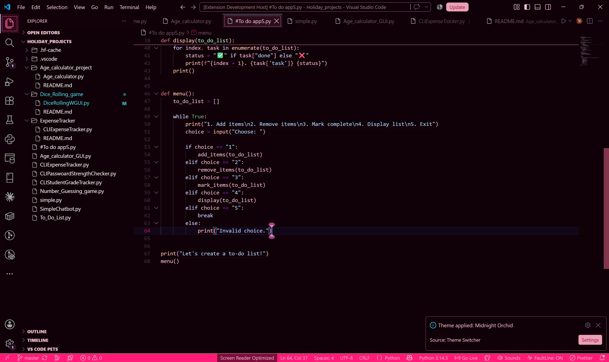

# Fairy Pink Dark

A dreamy dark VS Code theme with soft fairy-pink accents, designed to make coding feel a little more magical. ✨

## Preview

## Features

- Dark interface with pink accents
- High-contrast syntax highlighting
- Soft pink UI elements
- Designed for comfortable everyday coding
- Works across VS Code's editor and interface

## Theme

**Theme:** Pink Pixie

Fairy Pink Dark is built around a dark interface with pink and purple tones, giving VS Code a playful but focused aesthetic.

## Installation

### From the VS Code Marketplace

Search for:

**Fairy Pink Dark**

or install it directly from the Visual Studio Code Marketplace.

### Manual Installation

1. Clone this repository.
2. Open the project in VS Code.
3. Press `F5` to launch the Extension Development Host.
4. Open the Command Palette.
5. Search for `Preferences: Color Theme`.
6. Select **Pink Pixie**.

## Recommended For

- Python
- JavaScript / TypeScript
- HTML / CSS
- Data Science
- Machine Learning
- General development

## Repository

[GitHub](https://github.com/Ruvaaa/fairy-pink-dark)

## License

MIT